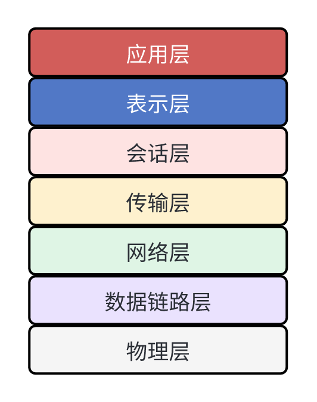
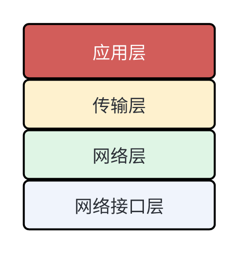

# Netty 实战

# 1. 网络协议

## 1.1 OSI 七层网络模型

OSI 网络模型上一套通用的网络协议规范，所有厂商都会基于这个模型来设计自己的网络协议。

### 1.1.1 OSI 七层模型

### 1.1.2 物理层

**物理层作用：在网络节点之间传输电信号（0或1）。**

举例

- 中美之间海底光缆
- 网线
- WIFI

### 1.1.3 数据链路层

**数据链路层作用：控制数据块的传输，实现局域网内通信。**

数据链路层将一组电信号成为一帧，一帧包含两个部分：

- Head 标头：用来保存一些元数据，最重要的就是源和目标 MAC 地址。此外还包含网络节点的数据类型等。
- Body 数据体：真正要传输的数据。

> MAC 地址是网卡生产商写在网卡中的 12 位十六进制的序列号，这个序列号是全球唯一的编号，序列号前 6 个十六进制是厂商编号，后 6 个十六进制是网卡的流水号。

**以太网协议：在数据链路层，网络通信都是局域网内通信。数据包通过广播的方式发送到整个局域网，局域网内的每个节点都会解析出其中的目标 MAC 地址，并于自己的 MAC 地址进行比对。如果相同就进行处理；否则直接丢弃。**

以太网协议工作原理

### 1.1.4 网络层

**网络层作用：实现跨局域网的通信。**

使用 IP 地址，来定位网络中的设备。

跨局域网通信过程：

1. 网络包在局域网内广播，由于目标 MAC 地址不同，因此局域网内其他设备都不会处理。
2. 路由器接收到该数据包，取出 IP 地址，判断出该 IP 所属的网段，转发给对应网段的下一条路由器。

**通过子网掩码，来判断 IP 地址是否处于同一网段。**

### 1.1.5 传输层

**传输层作用：实现应用程序间的通信。**

引入 **port 端口号**的概念，来区分同一台网络设备上的不同进程。

## 1.2 TCP 协议

### 1.2.1 TCP/IP 四层网络模型

OSI 七层模型是网络协议的理论标准，而 **TCP/IP 四层模型是网络通信的事实标准，同时也是对七层模型的简化。**

#### 网络分层的意义

- 各层独立，上下层之间解耦
- 灵活性、扩展性更好
- 易于维护和测试
- 易于形成标准化

#### TCP/IP 四层模型通信过程

### 1.2.2 TCP 与 UDP 的对比

|              |                      TCP                       |                             UDP                              |
| :----------: | :--------------------------------------------: | :----------------------------------------------------------: |
|    连接性    |                    面向连接                    |                          面向无连接                          |
|    可靠性    |                可靠传输，不丢包                |                  不可靠传输，尽最大努力交付                  |
|  网络包格式  |                   面向字节流                   |                         面向数据报文                         |
|   传输效率   |                       慢                       |                              快                              |
|   资源消耗   |                       大                       |                              小                              |
| 首部占用空间 |                       大                       |                              小                              |
|   适用场景   | 对可靠性要求较高场景：浏览器、文件传输、邮件等 | 对性能和网络带宽敏感，且对可靠性要求低的场景：直播、游戏、即时通信等 |
|  应用层协议  |             HTTP、HTTPS、FTP、SMTP             |                             DNS                              |

#### 注意：

1. TCP 是面向字节流的，数据以二进制字节的形式持续传输，TCP 不会在字节流中插入标识符，也不负责对字节流的语义进行解释，这部分的工作应该由应用层来处理，如解决拆包、粘包问题等。
2. TCP 所谓的“连接”，本质上是一系列状态的记录和算法的控制，并不是物理上真实存在一条传输通道。相对的，UDP 的“无连接”指的是没有复杂的状态和算法，只是尽最大可能把数据报文传输到对端。
3. TCP 层并没有所谓长连接和短连接的概念，长连接和短连接上面向应用层来说的。

### 1.2.3 TCP 协议数据报文结构

TCP 数据报文结构：

- 源/目的端口号：用于定位发端和收端应用进程。
- 序号：TCP 用序号对每次发送数据的字节进行计数。
- 确认序号：确认序号是接收方发出给发送方的，意思是接收方下次要接收的字节位置。**ACK 是已成功收到数据字节数加 1。**
- 首部长度
- 状态位表示：
  - URG：紧急指针（urgent pointer）
  - ACK：确认序号有效。
  - PSH：接收方应该尽快将数据从 TCP 放到应用层里。
  - RST：重建连接。也就是说以前的连接是异常的，需要重新建立连接。
  - SYN：同步序号，用来发起一个连接，用来做 TCP 连接建立的。
  - FIN：发端完成发送任务，用于关闭 TCP 连接。
- 窗口大小：通过滑动窗口协议来控制接收方接收字节数的大小，从而提升 TCP 的通信效率。
- 校验和：端到端的校验和，用于验证数据的正确性。
- 选项：一些控制参数，最常见的可选字段是最长报文大小，又称为 MSS（Maximum Segment Size）。
- 数据：真正要传输的数据部分。

### 1.2.4 TCP 连接的建立与关闭

#### TCP 连接状态迁移

#### 相关细节

1. 建立 TCP 连接时，需要进行三次握手，只要客户端与服务端都可以确认自己能向对方发送数据，同时能够从对方接受数据，各有一次数据的来回，就可以认为连接建立完成了。
2. 序列号 seq 的机制：在每次建立 TCP 连接时，会随机生成一个初始的32位 seq，后续在此连接上的数据传输都基于该序列号递增。当 seq 达到上限时会重置为0。**seq 机制的作用就是用来标识连接的唯一性，避免数据重传导致的通信混乱。**
3. 关闭 TCP 连接时，需要进行四次挥手，因为 TCP 是全双工协议，需要客户端和服务端都停止向对方发送数据，同时不再接收对方的数据，才可以关闭连接。
4. **当客户端发起 FIN 请求后，会进入半关闭（half-close）状态，此时服务端的连接还不能立即关闭，因为它可能还在向客户端发送数据，需要等服务端处理完成后再关闭连接，类似于微服务中的优雅停机。**
5. **客户端 TIME_WAIT 状态的作用**：客户端发出最后一个 ACK 后，服务端不一定能收到，如果未收到，服务端就会重传 FIN，因此客户端需要等待一定时间，用于接收服务端重传的 FIN 并再次 ACK，确保服务端可以关闭连接。这个等待的时间设置为 2MSL（Maximum Segment Lifetime，TCP 报文最大生存时间），因为从发送 FIN 数据报文到收到 ACK 数据报文，需要在网络上往返两次，最大时间不会超过 2MSL。处于 TIME_WAIT 状态的客户端，对于任何数据传输报文都会直接丢弃。

### 1.2.5 TCP 可靠性保证

#### 延迟确认

**通常 TCP 在接收到数据时并不立即发送 ACK，而是会采取延迟确认的方式，以便将 ACK 包与下一个数据包一起发送，从而提升传输效率。**

默认的延迟时间为 200ms。

#### Nagle 算法

**Nagel 算法作用于发送端，会把多个请求数据报文放入到一个分组中，当收到上个报文的 ACK 的时候再把当前分组发送出去。**

该算法要求一个 TCP 连接上最多只能有一个未被确认的分组，在该分组的确认到达之前不能发送其他的分组。

**延迟确认机制和 Nagle 算法的思想类似 Kafka 中的 Batch 机制，通过增加单条消息(网络数据包)的发送延迟，来提升整体的吞吐量。**

优点

- 可以将多个小数据包合并为一个大包，批量传输，大幅提升传输效率。
- 具备自适应能力，接收端 ACK 越快，发送端 Nagle 分组也就发送得越快，反之亦然。也就是说，发送数据分组的频率和接收端的处理能力是自适应的，这样就极大地提升了网络通信的弹性。

缺点：对于单个数据包来说，增加了传输的延迟，对于用户体验有一定影响。

适用场景：适用于频繁的小数据包传输，且对用户体验不敏感的场景。

#### 滑动窗口

**滑动窗口算法由接收端发起，通过 TCP 协议中的** **`wind`** **字段指定接收窗口大小。发送端会根据窗口大小动态调整数据报文的发送频率，从而起到流量控制的作用。**

在 TCP 数据通信的过程中，接收端会根据自身的处理能力，动态调整窗口大小，间接控制发送端的发送频率。

# 2. Java NIO

## 2.1 解决 Java BIO 性能问题

## 2.2 Java NIO 原理与应用

# 3. Netty

## 3.1 核心组件详解

## 3.2 网络事件的处理

## 3.3 支持高并发设计

## 3.4 内存管理组件

## 3.5 拆包与粘包

## 3.6 线程模型

# 4. 手写 RPC 框架

# 5. 手写 HTTP 服务

原文地址：https://mhibncatc0.feishu.cn/docx/DpsddtYs6oxJEDxaFWmcsFdHnJg
